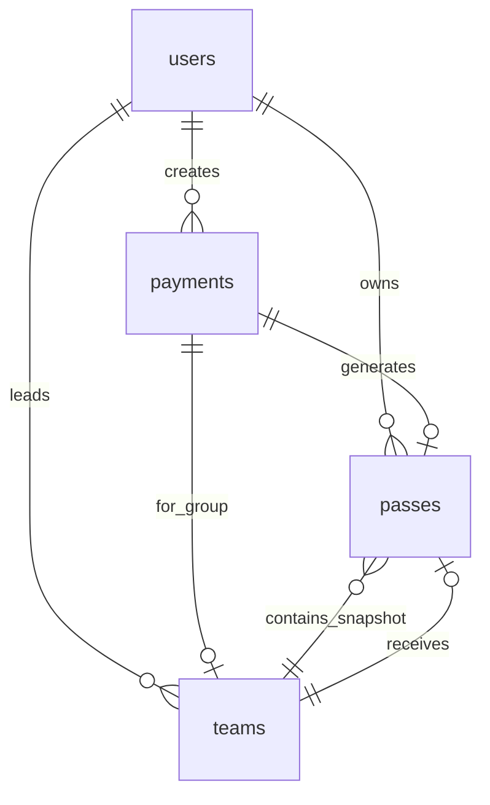

## 1. Overview

The CIT Takshashila 2026 platform uses **Firebase Firestore** as its primary database. All application data is modeled as documents in a small number of collections, with strict **security rules** and clear ownership semantics.

This document covers:

- Collections and document fields (table format)
- Relationships between collections
- Security rules and access patterns
- Validation and sanitization layers

---

## 2. Collections

### 2.1 `users` – User Profiles

- **Collection path:** `users/{userId}`
- **Document ID:** `userId` = Firebase Auth `uid`
- **Purpose:** Store profile information and organizer flag.
- **Access:** User can read and write **their own** profile; `isOrganizer` is controlled by admins only.

#### Schema

| Field        | Type                                       | Required | Description                                  |
|-------------|--------------------------------------------|----------|----------------------------------------------|
| `uid`       | `string`                                   | Yes      | User ID (Firebase Auth `uid`)                |
| `name`      | `string`                                   | Yes      | Full name                                    |
| `email`     | `string \| null`                           | No       | Email from auth provider                     |
| `college`   | `string`                                   | Yes      | College / institution name                   |
| `phone`     | `string`                                   | Yes      | Mobile number (10 digits, starts 6–9)        |
| `isOrganizer` | `boolean`                                | No       | Organizer flag (server‑managed, default `false`) |
| `createdAt` | `Timestamp`                                | Yes      | Creation time (server timestamp)            |
| `updatedAt` | `Timestamp \| Date`                        | No       | Last update time                             |

#### Read/Write Permissions

- **Read:** `request.auth.uid == userId`
- **Create:** `request.auth.uid == userId && request.resource.data.isOrganizer == false`
- **Update:** `request.auth.uid == userId && !request.resource.data.diff(resource.data).affectedKeys().hasAny(['isOrganizer'])`
- **Delete:** Denied

---

### 2.2 `payments` – Payment Orders

- **Collection path:** `payments/{paymentId}`
- **Document ID:** `paymentId` is a string like `order_{timestamp}_{userIdPrefix}` matching Cashfree `order_id`.
- **Purpose:** Track Cashfree order lifecycle and link to passes and teams.
- **Access:** Only the owning user can read; all writes are server‑side via Admin SDK.

#### Schema

| Field              | Type                             | Required | Description                                              |
|--------------------|----------------------------------|----------|----------------------------------------------------------|
| `userId`           | `string`                         | Yes      | Owner user UID                                           |
| `amount`           | `number`                         | Yes      | Amount in INR                                            |
| `passType`         | `string`                         | Yes      | One of `day_pass`, `group_events`, `proshow`, `sana_concert` |
| `cashfreeOrderId`  | `string`                         | Yes      | Cashfree `order_id` (same as doc ID)                    |
| `status`           | `'pending' \| 'success' \| 'failed'` | Yes   | Payment status                                           |
| `createdAt`        | `Timestamp \| Date`              | Yes      | When order was created                                   |
| `updatedAt`        | `Timestamp \| Date`              | No       | Last update timestamp                                   |
| `customerDetails`  | `{ name: string; email: string; phone: string; }` | Yes | Snapshot of buyer details                               |
| `teamId`           | `string \| null`                 | No       | Related `teams/{teamId}` for group_events               |
| `teamMemberCount`  | `number \| null`                 | No       | Member count for group events                           |
| `selectedDays`     | `string[] \| null`               | No       | Selected days for `day_pass`                            |

#### Read/Write Permissions

- **Read:** `request.auth != null && resource.data.userId == request.auth.uid`
- **Create/Update/Delete:** Denied in rules (server‑only via Admin SDK)

---

### 2.3 `passes` – Event & Proshow Passes

- **Collection path:** `passes/{passId}`
- **Document ID:** Auto‑generated.
- **Purpose:** Represent a verified pass that grants entry, with QR code and (optionally) group snapshot.
- **Access:** Owners and organizers can read; only organizers (via Admin SDK) can update; clients cannot create/delete passes directly.

#### Schema

| Field          | Type                                         | Required | Description                                               |
|---------------|----------------------------------------------|----------|-----------------------------------------------------------|
| `userId`      | `string`                                     | Yes      | UID of the pass owner                                     |
| `passType`    | `string`                                     | Yes      | `day_pass`, `group_events`, `proshow`, `sana_concert`     |
| `amount`      | `number`                                     | Yes      | Amount paid for this pass                                 |
| `paymentId`   | `string`                                     | Yes      | Related `payments/{paymentId}` / Cashfree `order_id`      |
| `status`      | `'paid' \| 'used'`                           | Yes      | Whether the pass has been scanned/used                    |
| `qrCode`      | `string`                                     | Yes      | Data URL for QR code image                                |
| `createdAt`   | `Timestamp \| Date`                          | Yes      | When pass was created                                     |
| `usedAt`      | `Timestamp \| Date`                          | No       | Time of first successful scan                             |
| `scannedBy`   | `string`                                     | No       | UID of organizer who scanned the pass                     |
| `teamId`      | `string`                                     | No       | Related `teams/{teamId}` for group passes                 |
| `teamSnapshot`| `TeamSnapshot` (see below)                   | No       | Immutable snapshot of team at time of payment             |
| `selectedDays`| `string[]`                                   | No       | Days included for `day_pass`                              |

**`TeamSnapshot` embedded type:**

| Field          | Type                                          | Description                                  |
|----------------|-----------------------------------------------|----------------------------------------------|
| `teamName`     | `string`                                      | Team name at time of payment                 |
| `totalMembers` | `number`                                      | Total members                                |
| `members`      | `{ memberId, name, phone, isLeader, checkedIn }[]` | Flattened snapshot of members & check‑in |

#### Read/Write Permissions

- **Read:** if `request.auth != null` and:
  - `resource.data.userId == request.auth.uid`, or
  - `get(/databases/$(database)/documents/users/$(request.auth.uid)).data.isOrganizer == true`
- **Create:** Denied (server‑only)
- **Update:** Allowed only if the requester is organizer (`isOrganizer == true`)
- **Delete:** Denied

---

### 2.4 `teams` – Group Event Teams

- **Collection path:** `teams/{teamId}`
- **Document ID:** `teamId` (typically a UUID or human‑readable identifier).
- **Purpose:** Represent a team for group events, including members and attendance state.
- **Access:** Team leader and organizers can read; only organizers can update; creation/deletion is server‑only.

#### Schema

| Field           | Type                                | Required | Description                                             |
|-----------------|-------------------------------------|----------|---------------------------------------------------------|
| `teamId`        | `string`                            | Yes      | Identifier (equals document ID)                         |
| `teamName`      | `string`                            | Yes      | Team name                                               |
| `leaderId`      | `string`                            | Yes      | UID of leader                                           |
| `leaderName`    | `string`                            | Yes      | Leader name                                             |
| `leaderEmail`   | `string`                            | Yes      | Leader email                                            |
| `leaderPhone`   | `string`                            | Yes      | Leader phone                                            |
| `leaderCollege` | `string`                            | Yes      | Leader college                                          |
| `members`       | `TeamMember[]`                      | Yes      | Array of team members with attendance state             |
| `totalMembers`  | `number`                            | Yes      | Total member count                                      |
| `totalAmount`   | `number`                            | Yes      | Total payment amount (e.g. 250 × members)               |
| `status`        | `string`                            | Yes      | Team registration status (e.g. `pending`)               |
| `orderId`       | `string`                            | Yes      | Related `payments/{paymentId}`                          |
| `paymentStatus` | `'pending' \| 'success'`            | Yes      | Payment status for the team                             |
| `passId`        | `string`                            | No       | Related `passes/{passId}` once pass is created          |
| `createdAt`     | `Timestamp`                         | Yes      | Creation time                                           |
| `updatedAt`     | `Timestamp`                         | Yes      | Last update time                                        |

**`TeamMember` embedded type:**

| Field                   | Type                 | Description                                           |
|-------------------------|----------------------|-------------------------------------------------------|
| `memberId`              | `string`             | Unique identifier within the team                     |
| `name`                  | `string`             | Member name                                           |
| `phone`                 | `string`             | Member phone                                          |
| `email`                 | `string`             | Member email                                          |
| `isLeader`              | `boolean`            | Whether this member is also the team leader           |
| `attendance.checkedIn`  | `boolean`            | Whether the member has checked in at the venue        |
| `attendance.checkInTime`| `Timestamp \| null`  | Time of check‑in                                      |
| `attendance.checkedInBy`| `string \| null`     | Organizer UID that checked them in                    |

#### Read/Write Permissions

- **Read:** if `request.auth != null` and:
  - `resource.data.leaderId == request.auth.uid`, or
  - Requester is organizer (`isOrganizer == true`)
- **Create/Delete:** Denied (server‑only)
- **Update:** Allowed only for organizers (intended for attendance updates)

---

### 2.5 `registrations` – Legacy Registration Records

- **Collection path:** `registrations/{doc}`
- **Purpose:** Legacy/initial registration flow; not used by current pass/payment implementation but kept for backwards compatibility or scripts.

#### Typical Fields (legacy)

| Field            | Type          | Description                                     |
|------------------|---------------|-------------------------------------------------|
| `uid`            | `string`      | Owner user UID                                  |
| `passType`       | `string`      | Legacy pass identifier                          |
| `amount`         | `number`      | Amount                                          |
| `paymentStatus`  | `string`      | Legacy status (`PENDING`, `PAID`, etc.)        |
| `cashfreeOrderId`| `string`      | Related order ID                                |
| `qrPayload`      | `string`      | Legacy QR payload                               |
| `createdAt`      | `Timestamp`   | Created at                                      |
| `updatedAt`      | `Timestamp`   | Updated at                                      |

#### Read/Write Permissions

- **Read:** `request.auth.uid == resource.data.uid`
- **Create/Update/Delete:** Denied (server‑only). New flows use `payments` + `passes` + `teams`.

---

## 3. Relationships

The schema uses explicit references between documents while embedding small, immutable snapshots where necessary.



### 3.1 One‑to‑One / One‑to‑Many

- **User → Payments**
  - One user can have many payment orders (`users/{uid}` → `payments/*` via `userId`).
- **User → Passes**
  - One user can own many passes (`passes.userId`).
- **User → Teams**
  - User can lead multiple teams (`teams.leaderId`).

### 3.2 Many‑to‑One / Many‑to‑Many

- **Team ↔ Pass**
  - Each team can have at most one pass (`teams.passId`).
  - Each pass can reference at most one team (`passes.teamId`).
- **Payments ↔ Teams / Passes**
  - A payment can produce a team (for group events) and a pass:
    - `payments.teamId` references `teams/{teamId}`.
    - `passes.paymentId` references `payments/{orderId}`.

### 3.3 Embedding vs Referencing

- **Referencing used for:**
  - Long‑lived records where state can change over time:
    - `payments` <–> `passes`
    - `passes` <–> `teams`
    - `teams` <–> `users`
  - Allows independent updates and queries.

- **Embedding used for:**
  - `teamSnapshot` inside `passes`:
    - Provides an immutable snapshot of team composition at time of payment.
    - Ensures that even if team membership changes later, the original pass snapshot remains consistent.

---

## 4. Security Rules Summary

From [`firestore.rules`](../firestore.rules):

```text
match /users/{userId} {
  allow read: if request.auth.uid == userId;
  allow create: if request.auth.uid == userId && request.resource.data.isOrganizer == false;
  allow update: if request.auth.uid == userId &&
    (!request.resource.data.diff(resource.data).affectedKeys().hasAny(['isOrganizer']));
}

match /registrations/{doc} {
  allow read: if request.auth.uid == resource.data.uid;
  allow create, update, delete: if false;
}

match /passes/{passId} {
  allow read: if request.auth != null &&
    (resource.data.userId == request.auth.uid ||
     get(/databases/$(database)/documents/users/$(request.auth.uid)).data.isOrganizer == true);
  allow create: if false;
  allow update: if request.auth != null &&
    get(/databases/$(database)/documents/users/$(request.auth.uid)).data.isOrganizer == true;
  allow delete: if false;
}

match /teams/{teamId} {
  allow read: if request.auth != null &&
    (resource.data.leaderId == request.auth.uid ||
     get(/databases/$(database)/documents/users/$(request.auth.uid)).data.isOrganizer == true);
  allow create, delete: if false;
  allow update: if request.auth != null &&
    get(/databases/$(database)/documents/users/$(request.auth.uid)).data.isOrganizer == true;
}

match /payments/{paymentId} {
  allow read: if request.auth != null && resource.data.userId == request.auth.uid;
  allow create, update, delete: if false;
}
```

Key points:

- Only owners can read their own `users`, `payments`, and (legacy) `registrations`.
- `isOrganizer` cannot be modified by the client – it is server/admin controlled.
- Only **organizers** (as per `users/{uid}.isOrganizer`) can:
  - Read all passes and teams
  - Update passes and teams (for scanning and attendance)
- Creation and deletion of `passes`, `teams`, and `payments` are **server‑only**.

These rules are complemented by backend checks in API routes (see `AUTHENTICATION_AUTHORIZATION.md` and `BACKEND_API_REFERENCE.md`).

---

## 5. Validation & Sanitization

Validation happens in two layers:

### 5.1 Zod Schemas (`src/lib/security/validation.ts`)

- `phoneSchema`
  - 10 digits
  - Starts with 6–9
- `nameSchema`
  - 2–50 characters
  - Letters and spaces only
- `collegeSchema`
  - 2–100 characters
  - Rejects obvious HTML/script content
- `userProfileSchema`
  - `{ name, college, phone }` with above constraints
- `paymentInitiationSchema`
  - Payload for payment initiation, including optional team data

Helpers:

- `validateProfileInput()`, `validatePhone()`, `validateName()`, `validateCollege()` – thin wrappers over Zod.

### 5.2 Sanitization Helpers

- `sanitizeInput()`:
  - Trims whitespace.
  - Removes `<` / `>`.
  - Strips `javascript:` URLs.
  - Removes inline event handlers (`on*=`).

Used before persisting user‑supplied strings to Firestore, especially for `college` and other free text fields.

---

## 6. Indexing & Query Patterns

### 6.1 Current Index Configuration

`firestore.indexes.json` currently contains:

```json
{
  "indexes": [],
  "fieldOverrides": []
}
```

Firestore’s **automatic single‑field indexes** are used by default.

### 6.2 Common Queries

- **User passes for “My Pass” page**

```ts
passesRef
  .where('userId', '==', uid)
  .where('status', '==', 'paid')   // sometimes
  .orderBy('createdAt', 'desc');
```

This typically requires a **composite index** on `(userId, status, createdAt)` (or at least `(userId, createdAt)`). Firestore will prompt for index creation in the console if it is missing.

- **Payments by order ID**

```ts
paymentsRef.where('cashfreeOrderId', '==', orderId);
```

Uses automatic single‑field index on `cashfreeOrderId`.

- **Passes by payment ID**

```ts
passesRef.where('paymentId', '==', orderId);
```

Uses single‑field index on `paymentId`.

### 6.3 Recommended Indexes

For production, ensure the following composite index exists:

- **Collection:** `passes`
- **Fields:**
  - `userId` – ascending
  - `status` – ascending (if used in query)
  - `createdAt` – descending

This improves performance and avoids Firestore “needs index” errors on the passes listing queries.

---

## 7. Summary

- The database model is **small and focused**, with 4 active collections (`users`, `payments`, `passes`, `teams`) and one legacy (`registrations`).
- Ownership and access control are enforced both via **Firestore rules** and **API‑level checks**.
- Relationships leverage a mix of **references** and **embedded snapshots** to balance consistency and queryability.
- Validation and sanitization layers help keep data clean and secure before it reaches Firestore.

For how these collections are used in flows such as registration, payment, and QR scanning, see:

- `PAYMENT_WORKFLOW.md`
- `PASS_QR_SYSTEM.md`
- `AUTHENTICATION_AUTHORIZATION.md`

