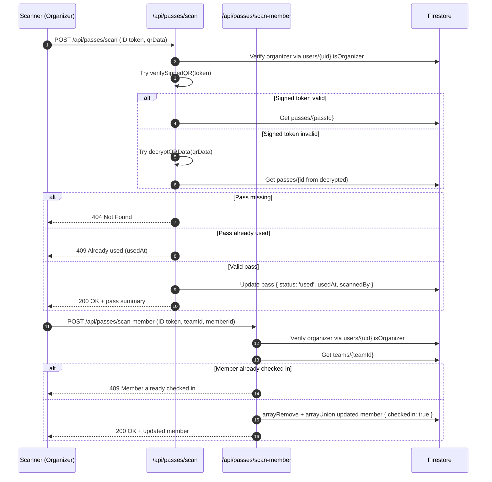

## Pass & QR System Documentation

This document covers how passes are represented, how QR codes are generated and validated, and how scan flows operate. It is based on:

- `src/lib/db/firestoreTypes.ts`
- `src/features/passes/qrService.ts`
- `src/lib/crypto/qrEncryption.ts`
- `app/api/passes/**`
- Payment and webhook routes that create passes.

---

### Pass Model Overview

Passes are stored in the `passes` collection and described by the `Pass` interface in `src/lib/db/firestoreTypes.ts`:

| Field           | Description                                                                                   |
|-----------------|-----------------------------------------------------------------------------------------------|
| `userId`        | UID of the user who owns the pass.                                                           |
| `passType`      | Type of pass (e.g., `day_pass`, `group_events`, `proshow`, `sana_concert`, `mock_summit`).   |
| `amount`        | Amount paid for this pass.                                                                   |
| `paymentId`     | Cashfree `orderId` (links to `payments` collection).                                         |
| `status`        | `'paid'` when issued, `'used'` after successful scan at entry.                               |
| `qrCode`        | Data URL (image) of the QR code; payload is either signed token or encrypted JSON.           |
| `createdAt`     | Timestamp/Date when the pass was created.                                                    |
| `usedAt`        | Timestamp/Date when the pass was used (set during scan).                                     |
| `scannedBy`     | UID of the organizer who scanned the pass.                                                  |
| `selectedEvents`| Array of event IDs for which this pass is valid.                                            |
| `selectedDays`  | Array of date strings (for day passes/proshows).                                            |
| `eventAccess`   | `{ tech, nonTech, proshowDays, fullAccess }` summary derived from events.                   |
| `teamId`        | Optional team ID for group passes.                                                           |
| `teamSnapshot`  | Immutable snapshot of the team at payment time (name, members, contact details).            |
| `countryId`     | Optional ID of mock summit country.                                                          |
| `countryName`   | Optional display name of mock summit country.                                               |

Passes are created in:

- `POST /api/webhooks/cashfree`
- `POST /api/payment/verify`
- `POST /api/admin/fix-stuck-payment`

All three routes enforce idempotency by checking for existing passes with the same `paymentId` before creating new ones.

---

### QR Payload Formats

There are two distinct QR payload schemes:

1. **Signed token payload** (compact, HMAC-signed string).
2. **Encrypted JSON payload** (rich, AES-encrypted object).

Both are validated by the scan API for backwards compatibility.

#### Signed Token Payload

Implemented in `src/features/passes/qrService.ts`:

- Uses an HMAC-SHA256 signature over a simple `passId:expiry` payload.
- Format:

```text
<passId>:<expiryTimestampMs>.<signatureHex>
```

Where:

- `passId`: ID of the pass document in Firestore.
- `expiryTimestampMs`: epoch milliseconds when the token expires.
- `signatureHex`: first 16 hex characters of HMAC-SHA256 digest using `QR_SECRET_KEY`.

Helper functions:

- `createSignedQR(passId: string, expiryDays = 30): string`
  - Computes `expiry = now + expiryDays * 24h`.
  - Returns `"passId:expiry.signature"`.
- `verifySignedQR(qrData: string)`
  - Parses payload and signature.
  - Verifies:
    - Format (3 segments).
    - `expiry` is in the future.
    - HMAC matches.
  - Returns `{ valid: boolean; passId?: string; error?: string }`.
- `createQRPayload(passId, userId, passType)`
  - Returns JSON string with:
    - `passId`, `userId`, `passType`, and a `token` generated by `createSignedQR`.

Where it is used:

- `POST /api/webhooks/cashfree`:
  - Creates QR data using `createQRPayload(passRef.id, userId, passType)`.
  - Renders Data URL via `QRCode.toDataURL(qrData)`.
- `GET /api/passes/qr`:
  - Generates a fresh QR token for an existing pass using `createQRPayload`.

#### Encrypted JSON Payload

Implemented in `src/lib/crypto/qrEncryption.ts`:

- Uses AES-256-CBC with:
  - Secret key: `QR_ENCRYPTION_KEY` (must be exactly 32 characters; enforced at import time).
  - Random 16-byte IV per encryption.
- Format stored in QR:

```text
<ivHex>:<cipherHex>
```

Where:

- `ivHex`: hex-encoded IV (32 characters for 16 bytes).
- `cipherHex`: hex-encoded ciphertext.

Helper functions:

- `encryptQRData(data: object): string`
  - Serializes `data` to JSON.
  - Uses AES-256-CBC to encrypt with `QR_ENCRYPTION_KEY` and random IV.
  - Returns `"ivHex:cipherHex"`.
- `decryptQRData(encrypted: string): any`
  - Splits `ivHex` and `cipherHex`.
  - Validates IV length.
  - Decrypts and parses JSON back to an object.

Where it is used:

- `POST /api/payment/verify`:
  - During pass creation, constructs a rich `qrData`:
    - For individual passes:
      - `{ id, name, passType, events, days }`.
    - For group passes:
      - `{ id, passType, teamName, members: [{ name, isLeader }], events, days }`.
  - Encrypts via `encryptQRData(qrData)`.
  - Renders QR Data URL via `QRCode.toDataURL(encryptedData)`.
- `POST /api/admin/fix-stuck-payment`:
  - Uses the same encrypted scheme to generate QR payloads.

---

### Expiry Logic

Expiry is applied only to the **signed token** variant via `createSignedQR` and `verifySignedQR`:

- Tokens encode an absolute expiry timestamp (ms).
- The scan endpoint calls `verifySignedQR` and:
  - Rejects if the time has passed.
  - Returns `{ valid: false, error: "QR expired" }` (error message depends on implementation).

Encrypted JSON payloads do not embed explicit expiry; they rely on:

- Pass document state (`status`, `usedAt`).
- Any policy decisions enforced in the scan endpoint (e.g., per-event or date-based rules, which can be added later).

---

### Scan Endpoint Logic

**Endpoint**: `POST /api/passes/scan`

#### Authentication & Authorization

- Requires `Authorization: Bearer <ID_TOKEN>`.
- Verifies token via `getAdminAuth()`.
- Loads `users/{uid}` from Firestore and checks:
  - `isOrganizer === true`.
- If the user is not an organizer:
  - Returns `403 Forbidden`.

#### Rate Limiting

- `checkRateLimit(req, { limit: 10, windowMs: 60000 })`.
- If exceeded, returns `429` with `Retry-After` header.

#### Request Body

- `{ "qrData": string }`
  - `qrData` can be:
    - A signed token string.
    - A JSON string containing `{ token, ... }`.
    - An encrypted payload string.

#### Pass Identification Flow

The endpoint attempts two decoding strategies sequentially:

1. **Signed token path**:
   - If `qrData` parses as JSON and contains `token`, use that as the token; otherwise, treat `qrData` as raw token.
   - Call `verifySignedQR(token)`:
     - If `valid === true`, set `passId = verification.passId`.
2. **Encrypted payload path**:
   - If no valid signed token:
     - Call `decryptQRData(qrData)`.
     - If decrypted object has `id`, use that as `passId`.

If both strategies fail:

- Returns `400 Invalid QR code`.

#### State Transition

Once `passId` is determined:

- Fetch `passes/{passId}`:
  - If not found: `404 Not Found`.
  - If `usedAt` is already set:
    - Returns `409 Conflict` with `usedAt`.
  - Else:
    - Updates pass with:
      - `status: "used"`.
      - `usedAt: new Date()`.
      - `scannedBy: organizerUid`.
    - Returns pass summary (at least `passId`, `passType`, `userId`, `status`).

This provides a simple **one-time entry** model per pass.

---

### Team Member Check-in Logic

**Endpoint**: `POST /api/passes/scan-member`

#### Purpose

For group events, organizers can mark individual team members as checked in, independent of the main pass scan.

#### Authentication & Authorization

- Requires `Authorization: Bearer <ID_TOKEN>`.
- Organizer-only (`users/{uid}.isOrganizer === true`).

#### Rate Limiting

- `checkRateLimit(req, { limit: 20, windowMs: 60000 })`.

#### Request Body

- `{ "teamId": string, "memberId": string }`.

#### Behavior

1. Fetch `teams/{teamId}`.
2. Find the member with `memberId`.
3. If `attendance.checkedIn === true`:
   - Return `409` with the existing `checkInTime`.
4. Else:
   - Use Firestore `arrayRemove` / `arrayUnion` to replace the member with an updated version:
     - `attendance.checkedIn: true`.
     - `attendance.checkInTime: serverTimestamp`.
     - `attendance.checkedInBy: organizerUid`.
5. Return the updated member data to the caller.

This allows finer-grained attendance tracking for group events.

---

### Dynamic QR Regeneration

**Endpoint**: `GET /api/passes/qr?passId=...`

#### Authentication & Authorization

- Requires `Authorization: Bearer <ID_TOKEN>`.
- Verifies token via Admin.
- Authorizes:
  - If `pass.userId === uid`, or
  - If `users/{uid}.isOrganizer === true`.

#### Behavior

1. Fetch `passes/{passId}`.
2. Authorize as above.
3. Call `createQRPayload(passId, pass.userId, pass.passType)` (signed token).
4. Render QR data URL via `QRCode.toDataURL`.
5. Return:
   - `qrCode`, `passType`, `userId`, `status`.

Dynamic regeneration:

- Ensures that even if an earlier QR code image is lost, the user or organizer can request a fresh code that is cryptographically linked to the same `passId`.
- Uses the **signed token** format, not the encrypted JSON format.

---

### Security Considerations

#### Secret Management

- `QR_SECRET_KEY`:
  - Used for HMAC signing of tokens.
  - Required at module import; if missing or empty, QR signing utilities throw.
- `QR_ENCRYPTION_KEY`:
  - Must be exactly 32 characters.
  - Used as the AES-256 key for encryption/decryption.
  - Validated at runtime; misconfigured keys cause runtime errors during encryption or decryption.

These secrets must be configured as **server-side environment variables** (not exposed to the client).

#### Forgery Resistance

- Signed tokens:
  - Attacker would need `QR_SECRET_KEY` to forge a valid signature.
  - Tokens embed an expiry timestamp, limiting replay.
  - Scan endpoint validates HMAC and expiry.
- Encrypted payloads:
  - Attacker would need `QR_ENCRYPTION_KEY` to generate a valid payload that decrypts to a plausible object.
  - Even if decrypted, the system uses only the `id` field to retrieve an existing pass; no new passes are created during scan.

#### Replay Attacks

- Replay protection is primarily via:
  - `passes.status` and `passes.usedAt`:
    - Once a pass is marked `used`, subsequent scans return 409 and do not re-admit.
  - Signed token expiry:
    - Prevents use of stale/long-lived tokens in regeneratable flows (where signed tokens are used).

#### Access Control

- Only organizer accounts can:
  - Scan passes (`/api/passes/scan`).
  - Scan team members (`/api/passes/scan-member`).
  - Read arbitrary passes and teams via Firestore rules.
- Owner users can:
  - Read their own passes via `/api/users/passes` and `/api/passes/[passId]`.
  - Request QR regeneration for their own passes via `/api/passes/qr`.

Organizer role is derived from server-authored `users/{uid}.isOrganizer` and protected from client tampering by Firestore rules on `appUsers`.

---

### Mermaid: Scan Flow Diagram



This reflects exactly how the scan-related endpoints and Firestore operations are implemented.

