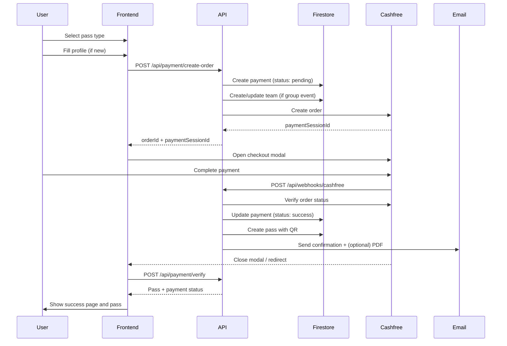

## 1. Overview

The payment system is built on **Cashfree Payment Gateway** and tightly integrated with **Firestore** and **email/QR generation**. It supports:

- Fixed‑price passes (day, group events, proshows, all‑access/SaNa concert)
- Secure checkout using Cashfree’s JS SDK (modal/popup)
- Dual verification:
  - Cashfree **webhook** → server‑initiated
  - Client‑side **verify** API → user‑initiated
- Automatic pass generation with signed QR codes and confirmation emails

This document describes:

- The end‑to‑end payment lifecycle
- Detailed request/response flows
- Error handling and recovery strategies

---

## 2. High-Level Payment Flow

### 2.1 Sequence Diagram



---

## 3. Pass Types & Pricing

Pass types are defined in `src/data/passes.ts` and mirrored in Firestore logic:

| Pass Type            | `passType`      | Amount (INR)                   | Notes                                      |
|----------------------|-----------------|---------------------------------|--------------------------------------------|
| Day Pass             | `day_pass`      | `500`                           | Single day event access                    |
| Group Events Pass    | `group_events`  | `250 × memberCount`            | Per‑person pricing, team registration      |
| Proshow Pass         | `proshow`       | `1500`                          | Day 1 + Day 3 proshows                     |
| All‑Access (SaNa)    | `sana_concert`  | `2000`                          | All 3 days: CIDA, SaNa The One, Day 3      |

Price is validated server‑side on each `create-order` call; client cannot override.

---

## 4. Detailed Flow: From Registration to Pass

### 4.1 Pre-Conditions

Before starting payment:

1. User is **signed in** via Firebase Auth.
2. User has a **completed profile** (`users/{uid}`) with `name`, `college`, `phone`.
3. User navigates to `/register/pass` and selects a pass type (potentially providing team data for group events).

### 4.2 Step 1 – Create Order (`POST /api/payment/create-order`)

**Input:** See `BACKEND_API_REFERENCE.md` for full schema.

Server‑side operations:

1. Verify **ID token** from `Authorization: Bearer <idToken>`.
2. Validate request body:
   - `passType` is one of the allowed values.
   - `amount` matches pass rules and team size.
   - Phone and name formats are valid (Zod + sanitization).
3. Compose `payments/{orderId}` document:
   - `userId`, `amount`, `passType`, `status = 'pending'`
   - `customerDetails` and optional `teamId`, `teamMemberCount`, `selectedDays`.
4. For **group_events**:
   - Creates or updates a `teams/{teamId}` document containing:
     - Leader details (from profile).
     - Members array with `attendance` set to unchecked.
5. Call **Cashfree** to create an order:
   - Uses environment:
     - `NEXT_PUBLIC_CASHFREE_ENV=production` → `https://api.cashfree.com/pg`
     - Otherwise → `https://sandbox.cashfree.com/pg`
   - Includes:
     - `order_amount = amount`
     - `customer_details` (name, email, phone)
     - `notify_url` pointing to `/api/webhooks/cashfree`
6. Persist `payments/{orderId}` in Firestore.
7. Return `{ orderId, paymentSessionId }` to the frontend.

If any step fails:

- Validation errors → `400` with message.
- Auth failures → `401`.
- Rate limit → `429`.
- Cashfree/Firestore errors → `500`.

### 4.3 Step 2 – Open Cashfree Checkout (Frontend)

The frontend uses `openCashfreeCheckout()` from `src/features/payments/cashfreeClient.ts`:

```ts
const cf = await load({ mode: process.env.NEXT_PUBLIC_CASHFREE_ENV === 'production' ? 'production' : 'sandbox' });
const result = await cf.checkout({ paymentSessionId, redirectTarget: '_modal' });
```

Possible outcomes:

- `result.error` – popup closed or payment error; user is informed.
- `result.redirect` – Cashfree opened in another context; user will be redirected back.
- `result.paymentDetails` – indicates payment flow ended; real status still confirmed via verify/webhook.

### 4.4 Step 3 – Webhook Handling (`POST /api/webhooks/cashfree`)

Cashfree sends a webhook upon payment events:

1. API verifies HMAC signature using Cashfree secret key.
2. If signature invalid → `401` (ignored by client but visible in logs).
3. If event type is a success type (e.g. `PAYMENT_SUCCESS_WEBHOOK`):
   - Extract `order_id`.
   - Load `payments/{orderId}`.
   - If not found:
     - Return `{ ok: true }` (avoids repeated webhook retries).
   - If status already `success`:
     - Return `{ ok: true }` (idempotent).
   - If status `pending`:
     - Call Cashfree Orders API to double‑check status.
     - If payment is successful:
       - Update `payments.status = 'success'`.
       - Create a pass (if not already created):
         - See **Step 5 – Pass Creation**.
       - Send email (see **Email Integration**).
4. Return `{ ok: true }` regardless of branch, unless there’s a critical server error.

### 4.5 Step 4 – Client Verification (`POST /api/payment/verify`)

After the Cashfree modal closes or the user lands on a `/payment/callback` page, the frontend:

1. Reads `orderId` (from query params or route state).
2. Calls `POST /api/payment/verify` with body `{ orderId }`.

On the server:

1. Looks up `payments/{orderId}`.
2. If not found → `404`.
3. If status is already `success`:
   - Looks for corresponding `passes` document.
   - If found, returns it directly.
4. If status is `pending`:
   - Calls Cashfree Orders API to fetch status.
   - On success:
     - Updates payment to `success`.
     - Creates pass if needed (same as webhook).
   - On failure or pending:
     - Returns appropriate message to frontend.

The endpoint contains retry logic (e.g. up to 3 attempts with short delays) to account for racing with the webhook.

### 4.6 Step 5 – Pass Creation & QR Generation

Common logic shared by webhook and verify flows:

1. Check if a `passes` document already exists for this `paymentId`:
   - If yes → reuse existing pass (idempotent).
2. Create a new `passes/{passId}` document:
   - `userId`, `passType`, `amount`, `paymentId`, `status = 'paid'`, `createdAt`.
   - For `group_events`:
     - Load `teams/{teamId}` and snapshot team:
       - `teamSnapshot = { teamName, totalMembers, members[] }`.
3. Generate **QR payload** (see `PASS_QR_SYSTEM.md`):
   - Build payload object containing `passId`, `userId`, `passType`, `teamId?`, `timestamp`.
   - Sign with `QR_SECRET_KEY` using HMAC‑SHA256.
   - Generate token string `passId:expiry.signature`.
   - Render QR image and store as Data URL in `qrCode`.
4. Store `qrCode` in the pass document.

---

## 5. Email Integration

After successful payment and pass creation, the backend sends a confirmation email using **Resend** (`src/features/email/emailService.ts`):

- Uses the `passConfirmation` template:
  - Includes name, amount, passType, college, phone.
  - Embeds the QR code image URL (`qrCodeUrl`).
- Optionally attaches a **PDF pass** generated via `jspdf` + `canvas`.

If the email fails:

- The error is logged.
- The API returns success for payment/pass operations; email failures do **not** roll back pass creation.

See `EMAIL_SYSTEM.md` for full details.

---

## 6. Error Handling & Recovery

### 6.1 User-Facing Failures

Typical user‑visible issues and responses:

- **Cashfree modal closed / payment cancelled**
  - `openCashfreeCheckout` returns `{ success: false, message: 'Payment cancelled or failed' }`.
  - UI shows an error toast or inline message; no changes are made in Firestore.

- **Validation errors on /api/payment/create-order**
  - 400 with descriptive error; UI shows error near form.

- **Session expired / token invalid**
  - 401; frontend prompts user to re‑login.

### 6.2 Stuck Payments

“Stuck payment” = payment captured at Cashfree but system did not successfully transition to `success` and/or create a pass (e.g. webhook dropped, network error, server restart).

Recovery mechanisms:

1. **User‑initiated verify (`/api/payment/verify`)**
   - The normal verify endpoint will:
     - Re‑query Cashfree for order status.
     - Create pass if payment is confirmed.

2. **Admin endpoint `/api/admin/fix-stuck-payment`**
   - Accepts `{ orderId }`.
   - Fetches payment from Firestore.
   - Calls Cashfree orders API.
   - If paid:
     - Forces status to `success`.
     - Ensures pass is created and email is sent.
   - Returns explicit debug information.

**Important:** This endpoint has **no auth** and should be protected operationally (e.g. via IP allow‑listing, not documented publicly).

### 6.3 Cashfree or Network Failures

If Cashfree APIs are unreachable or return unexpected errors:

- `/api/payment/create-order`:
  - Returns `500` and does not create a payment/pass record (or rolls back appropriately).
  - Frontend informs the user and suggests retrying.

- `/api/payment/verify` and `/api/webhooks/cashfree`:
  - Log error details.
  - Keep payment in `pending` state.
  - Can later be recovered using the admin endpoint.

---

## 7. Testing Payment Flows

### 7.1 Sandbox Configuration

For local and staging environments:

- `NEXT_PUBLIC_CASHFREE_ENV=sandbox`
- Use Cashfree sandbox credentials:
  - `NEXT_PUBLIC_CASHFREE_APP_ID`
  - `CASHFREE_SECRET_KEY` (test key)

### 7.2 Scripts

The `scripts/` directory contains helpers to validate payment logic end‑to‑end:

- `scripts/testing/simulate-paid-flow.js`
  - Simulates a full paid flow including Cashfree interactions (mock or sandbox).
- `scripts/testing/test-server-pdf.mjs`
  - Tests PDF generation logic.
- `scripts/testing/test-email.js`
  - Tests email sending with Resend.
- Additional DB/payment scripts for:
  - Inspecting a payment.
  - Manually verifying an order.
  - Generating test passes.

These scripts are intended for developers and DevOps engineers to test without going through the UI every time.

---

## 8. Security Considerations

- All monetary amounts are **validated server‑side** and never trusted from the client.
- Payment state transitions are always backed by:
  - Cashfree orders API calls, and
  - Cashfree webhooks with verified signatures.
- Passes are generated **only after** a confirmed, successful payment state.
- QR tokens are:
  - Signed with `QR_SECRET_KEY`.
  - Time‑bound (expiry embedded in token).
  - Validated during every scan.
- Firestore rules:
  - Prevent any client from modifying `payments`, `passes`, or `teams` directly.
  - Limit reads to owners (plus organizers where appropriate).

For a full list of environment variables used by the payment system, see `DEPLOYMENT_HOSTING.md`.

