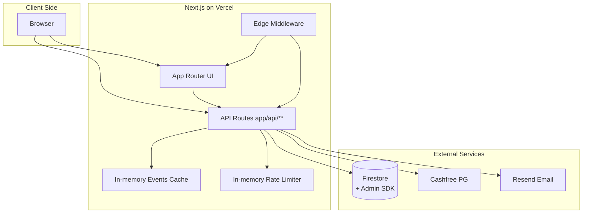

## Performance & Scalability Analysis

This document analyzes frontend and backend performance characteristics, data access patterns, and scalability considerations for the TKwebsite application, based solely on repository code.

---

### 1. Frontend Bundle & Rendering Strategy

#### App Router & Component Types

- Uses Next.js App Router (`app/layout.tsx`, `app/page.tsx`, and route segments under `app/**`).
- `RootLayout` is a server component:
  - Handles metadata, viewport, font imports, and wraps children in providers.
- Most page components (`app/page.tsx`, `app/events/page.tsx`, `app/register/**`, `app/payment/**`) are **client components** (`'use client'`):
  - They rely heavily on:
    - React hooks.
    - Animation libraries (GSAP, Framer Motion).
    - Firebase client APIs.

Implication:

- The initial HTML is server-rendered, but hydration payloads include significant client-side code for UI and animations.

#### WebGL & 3D Content

- The `Lanyard` component uses React Three Fiber, Drei, Rapier, and meshline:
  - Considerable JS and WASM weight, plus GPU usage.
- `next.config.ts` disables `reactStrictMode`:
  - Comment indicates React 19 double-mount behavior breaks WebGL contexts.
  - This is a trade-off: fewer dev-time safeguards in exchange for stable WebGL behavior.

Performance implications:

- On low-end devices, the 3D lanyard may be heavy.
- However, it appears on a single page (`/register/my-pass`), not globally, mitigating impact.

#### Code Splitting & Chunking

- `next.config.ts`:
  - Configures production webpack `splitChunks.maxSize: 200_000` (200 KB).
  - Encourages smaller chunks for better caching and parallel loading.
- No evidence of explicit dynamic imports in page-level code for major sections (beyond animation plugins).

Implications:

- Shared libraries (GSAP, Three.js, etc.) may still contribute to sizeable chunks, but chunk splitting improves cache hit rates on repeat visits.

---

### 2. Global CSS & Tailwind Integration

#### CSS Model

- Uses Tailwind v4 via `@import "tailwindcss";` in `styles/globals.css`.
- Additional CSS layers:
  - `reset.css`, `components.css`, `proshows-premium.css`.
  - `tw-animate-css` and Shadcn Tailwind layer.
- `globals.css`:
  - Very large, but structured:
    - CSS custom properties for colors, spacing, typography.
    - Layout primitives and nav behavior.
    - Lenis scroll styles.
    - Animation helpers.
    - Reduced-motion adjustments.

Performance implications:

- A large global stylesheet can:
  - Increase CSS download size.
  - Slightly increase style recalculation and layout complexity.
- However:
  - Heavy animations (GSAP/Three.js) dominate runtime cost more than CSS size.
  - The CSS is kept performant by:
    - Using GPU-friendly transforms (`translateZ(0)`, `will-change: transform`).
    - Hiding scrollbars and preventing horizontal overflow.

#### Tailwind & Tokens

- Design tokens live in CSS variables (e.g., `--background`, `--foreground`, `--nav-*`).
- Tailwind utilities are used primarily for layout and spacing.
- Shadcn integration uses tokens defined in `globals.css` and standard Tailwind classes.

This hybrid approach:

- Offers flexibility without requiring huge Tailwind config files.
- Keeps theme changes centralized in one CSS file.

---

### 3. Data Access Patterns

#### Frontend Data Fetching

- Firebase client SDK:
  - Used in `AuthContext` to fetch `appUsers/{uid}`.
  - Used in `pdfGenerator.client.ts` to fetch `users/{userId}`.
- HTTP fetch:
  - `/api/passes/types` for dynamic pass pricing/metadata.
  - `/api/users/passes` for listing passes on `/register/my-pass`.
  - `/api/events` for events page and filtering.
  - `/api/payment/create-order` & `/api/payment/verify` for payment flow.

Caching patterns:

- `AuthContext` caches last-fetched profile UID to avoid redundant reads.
- The events API uses server-side in-memory caching (see below), so repetition on the client is not costly to Firestore.

Potential improvements:

- Could add client-side caching with React Query / SWR, but current access patterns are moderate and mostly one-shot per page, so not critical.

#### Backend Firestore Access

- Heavy usage areas:
  - Payment verification and webhook handling:
    - Payment lookups.
    - Pass creation and team snapshots.
  - Admin reconciliation:
    - Full scans of `payments` and `passes`.
- Light/moderate usage:
  - Events:
    - Managed via in-memory cache.
  - User profiles:
    - Lookups in `users/{uid}`.

---

### 4. Events Cache & Serverless Behavior

The events cache in `src/lib/cache/eventsCache.ts` is a major performance optimization:

- Reads `events` from Firestore only:
  - When cache is empty or stale.
  - When invalidated manually via `/api/events/invalidate`.
- All of the following reuse the cached data:
  - `GET /api/events`
  - `/api/payment/create-order` (event validation).
  - `/api/payment/verify` (event access computation).
  - `/api/webhooks/cashfree` (event access computation).
  - `/api/admin/fix-stuck-payment` (same).

Scalability implications:

- Reduces Firestore read load under increasing traffic.
- On serverless platforms:
  - Each instance has its own in-memory cache.
  - Under heavy scaling, cache coherency is eventual:
    - Instances may hold slightly stale event data until TTL or manual invalidation.
  - For events (which are not frequently modified in production), this is acceptable.

---

### 5. Serverless Scaling Model

#### Compute Model

- The app is designed for Vercel-like deployment:
  - Stateless route handlers under `app/api/**`.
  - `middleware.ts` running on Edge by default.
  - No reliance on local file writes or long-lived background jobs.

#### Horizontal Scaling

Under horizontal scaling:

- **Stateless parts** scale naturally:
  - App routes and API routes are independent.
  - Firestore Admin connections are created per instance.
- **In-memory state** is per-instance only:
  - Events cache.
  - Rate limiter store.

Implications:

- Events:
  - Slightly higher Firestore reads on scale until caches on each instance warm.
- Rate limiting:
  - Not global; distributed across instances.
  - An attacker could exploit this if they can direct traffic across many instances.

---

### 6. Performance Hotspots & Tradeoffs

Based on code, the following hotspots are likely:

#### 6.1 Animations & 3D

- **GSAP-based sections**:
  - `HighlightsCarousel`:
    - Complex horizontal loop and draggable behavior.
    - Lazy loads heavy plugins to reduce initial bundle, but runtime cost remains.
  - `EventsGrid`:
    - Scroll-triggered animations across many cards.
- **Music portfolio**:
  - Uses GSAP ScrambleText, idle timelines, background parallax, and audio playback per item.
  - Could be expensive on low-end devices.
- **Lanyard (React Three Fiber)**:
  - 3D rendering + physics.
  - Involves WebGL context and GPU load.

Mitigations implemented:

- Lazy-loading of animation libraries and plugins via `useGSAP`.
- Respect for `prefers-reduced-motion` in CSS and GSAP usage.
- Conditional or session-based loading:
  - Loading screen is shown only once per session due to `sessionStorage`.
  - Heavy components are scoped to specific pages.

#### 6.2 Payment Verification Polling

- `/api/payment/verify`:
  - Up to 3 retries when locating `payments` in Firestore.
  - Up to 5 polling attempts against Cashfree `/orders/{orderId}` with 2s delays.

Impact:

- On worst-case flows:
  - A single verify attempt could take up to ~10 seconds of waiting.
  - However, error messages instruct the client to retry later, and each call is still bounded.

Potential tuning:

- Shorten or parameterize retry timings if Cashfree latency characteristics are known.

#### 6.3 Admin Reconciliation

- `GET /api/admin/reconcile-payments`:
  - Reads entire `payments` and `passes` collections.
  - Intended for occasional use, not for frequent or automated calls.

Scalability:

- On large datasets, this operation can become slow and memory-intensive.
- Mitigation is primarily operational:
  - Limit usage to off-peak times.
  - Consider pagination or query filtering if the dataset grows significantly.

---

### 7. Rate Limiting & Abuse Scenarios

In-memory rate limiting:

- Provides basic per-instance protection against:
  - Rapid order creation.
  - Repeated verify calls.
  - Brute-force scanning (scan / scan-member).

However, without distributed coordination:

- An attacker can:
  - Potentially circumvent per-instance limits by distributing load across multiple serverless instances.

From a performance perspective:

- Rate limits help reduce accidental or buggy client impact (e.g., loops repeatedly calling verify).
- They do not fully protect against coordinated abuse at large scale.

---

### 8. Optimization Recommendations

Based on code review, the following improvements are recommended:

#### 8.1 Distributed Rate Limiting

- Replace the in-memory `rateLimiter` with a backend tied to:
  - Redis or Upstash Redis.
  - Another distributed KV store supporting atomic increments and expirations.
- Benefits:
  - Consistent limits across all instances.
  - Stronger protection against abusive traffic and brute-force attacks.

#### 8.2 Dynamic Imports for Heavy Components

Some heavy components could benefit from route- or viewport-based dynamic imports:

- Candidates:
  - `Lanyard` (3D component).
  - `music-portfolio` and potentially other GSAP-heavy sections.
- Approach:
  - Wrap in `next/dynamic` with `ssr: false` where appropriate.
  - Trigger imports only when the corresponding UI is visible or when a user explicitly navigates to that section.

This would:

- Reduce initial JS bundle size for users who never visit heavy sections.

#### 8.3 React Query / SWR for Repeated Fetches

While not strictly necessary at current complexity:

- Introducing React Query / SWR for:
  - `/api/users/passes` on `/register/my-pass`.
  - `/api/events` on `/events` and registration flows.
- Would:
  - Deduplicate requests on navigation.
  - Improve UX under intermittent network conditions.

#### 8.4 Logging & Monitoring

The code already logs significant details around payment and webhook flows:

- Establish structured logging and monitoring (e.g., log aggregation) in production to:
  - Detect slow Cashfree responses.
  - Monitor retry counts.
  - Identify patterns in failed verifications.

This helps tune retry behavior and spot integration issues early.

#### 8.5 CSS & Layout Profiling

Given the rich global CSS:

- Periodic profiling in Chrome DevTools:
  - Check for layout thrashing during scroll.
  - Identify any selectors that cause repeated heavy recalculations.
- Most classes already lean on transforms, but real-world profiling is recommended once traffic and content scale up.

---

### 9. Mermaid: Scaling Overview

This diagram summarizes how multiple Vercel instances, each with their own in-memory caches and rate limiters, sit in front of shared services (Firestore, Cashfree, Resend).

---

### 10. Summary

The TKwebsite application makes substantial use of animations and rich visuals, but:

- Applies reasonable optimizations:
  - Lazy-loading animation libraries.
  - GPU-friendly CSS.
  - Session-aware loading screens.
  - Event caching on the server.
- Properly leverages serverless patterns:
  - Stateless API routes.
  - On-demand Firestore Admin usage.
  - In-memory caching aligned with route semantics.

Key scalability and performance improvements to consider as traffic grows:

- Introduce distributed rate limiting.
- Dynamically import heavy components where feasible.
- Add client-side caching for frequent read APIs.
- Maintain strong monitoring for payment flows and webhooks.

With these measures, the current architecture can scale effectively while maintaining a high-quality, animation-rich user experience.

