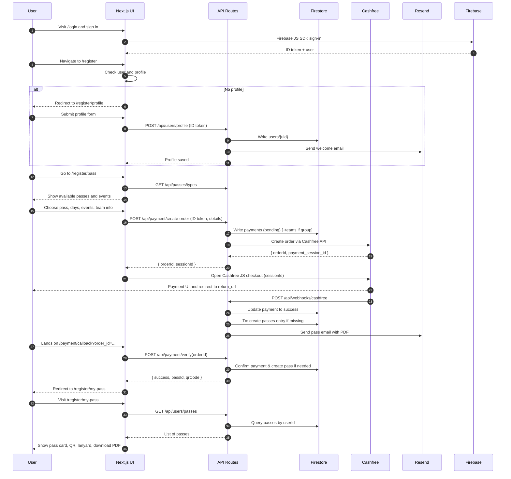

## Registration & Pass Purchase Flow

This document describes the end-to-end registration flow: from authentication and profile setup through pass selection, payment initiation, and post-payment experience.

All behavior is derived from:

- `app/login/page.tsx`
- `app/register/**`
- `app/payment/**`
- `src/components/sections/registration/**`
- `src/features/auth/**`
- `src/features/payments/**`
- Related backend APIs.

---

### High-level Flow

1. **User authenticates** via Google (`/login`).
2. **Profile is created or updated** (`/register/profile` and `/api/users/profile`).
3. **User selects a pass and events** (`/register/pass` UI + `REGISTRATION_PASSES` and event data).
4. **Payment order is created** (`/api/payment/create-order`).
5. **User completes payment** via Cashfree JS SDK.
6. **Webhook and/or verify endpoint** finalizes payment and creates a pass.
7. **User views pass and downloads PDF** (`/register/my-pass`).

---

### Authentication & Login

**Page**: `/login` → `app/login/page.tsx`

- Uses `useAuth()` from `AuthContext`.
- Renders:
  - A Google sign-in button that calls `signIn()` from `authService.ts`.
  - Error handling for popup failures, network issues, or misconfiguration.
- On successful sign-in:
  - Redirects to `/register`.

Authentication is powered by Firebase JS SDK initialized in `src/lib/firebase/clientApp.ts`.

---

### Registration Router (`/register`)

**Page**: `/register` → `app/register/page.tsx`

- Client-side orchestrator that decides where to send the user:
  - Loads `user` and `userData` (profile) from `AuthContext`.
  - Behavior:
    - If not authenticated:
      - Redirects to `/login`.
    - If authenticated & has profile:
      - Redirects to `/register/pass`.
    - If authenticated & no profile:
      - Redirects to `/register/profile`.
- While making decisions:
  - Shows a loading indicator via `LoadingContext`.

This ensures users always complete a profile before attempting to buy passes.

---

### Profile Creation (`/register/profile`)

**Page**: `/register/profile` → `app/register/profile/page.tsx`

- Guarded by auth:
  - If not logged in, navigates to `/login`.
- UI:
  - Renders a profile form that collects:
    - `name`
    - `college`
    - `phone`
    - `ID card / student ID` (uploaded to Firebase Storage)
  - Uses components under `src/components/sections/registration/**`, including a modal-based registration form.

**Client-side behavior**:

- Uses Firebase client `db` and `storage` from `clientApp.ts`:
  - Upload ID card to Storage and obtain URL.
  - Write profile data to `users/{uid}` directly or via `/api/users/profile`.
- On success:
  - Redirects to `/register/pass`.

**Server-side behavior**:

- `/api/users/profile` (POST):
  - Validates `name`, `college`, `phone` using `validation.ts`.
  - Writes `users/{uid}` via Admin SDK:
    - On first creation:
      - `isOrganizer: false`.
      - `createdAt`, `updatedAt`.
      - Sends a welcome email via Resend.

---

### Pass Selection (`/register/pass`)

**Page**: `/register/pass` → `app/register/pass/page.tsx`

- Guards:
  - If not logged in: redirects to `/login`.
  - If profile missing: redirects to `/register/profile`.

**UI components**:

- `RegistrationPassesGrid`:
  - Renders a grid of pass options using:
    - Static metadata from `REGISTRATION_PASSES` (`src/data/passes.ts`).
    - Dynamic pricing from `/api/passes/types` merged with static data.
  - Each pass option:
    - Lists included features, access, and pricing.
    - Presents actions to:
      - Open a modal to select events/days and complete registration.

- Pass-specific modals:
  - Implemented under `src/components/sections/registration/**`:
    - Day pass modal.
    - Group events modal (with team details).
    - Proshow pass modal.
    - SANA arena pass modal.
  - Each modal:
    - Collects necessary fields for the specific pass type (e.g., `selectedDays`, event choices, team members).
    - Initiates the payment flow when the user confirms.

---

### Payment Initiation

From within registration modals (e.g., `RegistrationFormModal`):

1. Client assembles request:
   - `userId` from `AuthContext.user.uid`.
   - `amount` from pass configuration.
   - `passType` from pass definition.
   - `teamData` (name, email, phone, college).
   - `teamId` and `members` for group passes.
   - `selectedDays` and `selectedEvents`.
   - `mockSummitAccessCode` and `countryId` if applicable.
2. Client obtains an ID token:
   - `auth.currentUser?.getIdToken(true)` from Firebase client SDK.
3. Client calls:

```ts
await fetch("/api/payment/create-order", {
  method: "POST",
  headers: {
    "Content-Type": "application/json",
    Authorization: `Bearer ${idToken}`,
  },
  body: JSON.stringify(payload),
});
```

4. On `200 OK`:
   - Receives `orderId` and `sessionId`.
   - Passes `sessionId` to `openCashfreeCheckout(sessionId, orderId)` from `src/features/payments/cashfreeClient.ts`.

5. `openCashfreeCheckout`:
   - Loads Cashfree JS SDK (`@cashfreepayments/cashfree-js`) on the client.
   - Calls `cashfree.checkout` with:
     - `paymentSessionId: sessionId`.
     - `redirectTarget: '_modal'`.
   - Resolves with a `CheckoutResult` indicating:
     - `success`.
     - Error conditions (e.g., user closed modal, network error, etc.).

The flow then transitions to Cashfree UI. After completion, Cashfree:

- Calls `notify_url` (webhook).
- Redirects the user to `return_url` (callback page).

---

### Post-payment Callback Pages

There are two callback-style pages using the verification API.

#### `/payment/callback`

- Reads `order_id` from query string.
- Shows a status view while:
  - Calling `/api/payment/verify` with `{ orderId }`.
  - Implementing a low-number retry strategy on the client.
- On `success: true`:
  - Redirects to `/register/my-pass`.
- If user is not logged in:
  - Prompts sign-in and then retries verification.

#### `/payment/success`

- Similar in spirit to `/payment/callback`:
  - Reads `order_id`.
  - Optionally attaches an ID token.
  - POSTs to `/api/payment/verify`.
  - Shows verifying, success, or error messages.
- Useful for legacy or alternate flows.

In both cases, `/api/payment/verify`:

- Ensures a payment exists and is `PAID`.
- Creates a pass if none exists.
- Returns `passId` and `qrCode` (or notes that a pass already exists).

---

### Viewing Passes (`/register/my-pass`)

**Page**: `/register/my-pass` → `app/register/my-pass/page.tsx`

- Requires authentication (redirect to `/login` if not logged in).
- Behavior:
  - Fetches user passes via `/api/users/passes`.
  - Fetches `users/{uid}` profile where needed (e.g., for lanyard).
  - Renders:
    - `MyPassCard`:
      - Shows pass type, amount, status, and QR image (if present).
      - Has a “Download PDF” button.
    - `Lanyard` 3D component:
      - Uses pass and user details to render a lanyard with pass texture and optional QR code.

**Download PDF**:

- Uses `generatePassPDF` from `src/features/passes/pdfGenerator.client.ts`:
  - Fetches `users/{userId}` from Firestore client SDK to include name, college, phone.
  - Embeds:
    - Logo (converted from SVG to PNG using a canvas).
    - QR code from `passData.qrCode`.
    - Textual details (pass type, amount, events, team info).
  - Generates a PDF with `jsPDF` and prompts the browser to download.

Separately, emails triggered by server-side flows attach a server-generated PDF using `generatePassPDFBuffer`.

---

### Error States & Edge Cases

#### Auth & Profile

- **Unauthenticated user**:
  - Accessing `/register`, `/register/profile`, `/register/pass`, `/register/my-pass`:
    - Redirects to `/login`.
- **Missing profile**:
  - Accessing `/register/pass`:
    - Automatically redirects user to `/register/profile`.

#### Create-order Validation Failures

Examples of errors returned by `/api/payment/create-order`:

- Invalid pass type:
  - `400 "Invalid pass type"`.
- Mismatched amount:
  - `400 "Invalid amount"`.
- Missing `selectedEvents`:
  - `400 "Event selection is required"`.
- Inactive or invalid events:
  - `400` with a message listing inactive or non-existent events.
- Group pass issues:
  - `400 "Group pass must select exactly one event"`.
  - `400 "Selected event must be a group event"`.
  - Messages about team size being too small/large.
- Proshow rules:
  - `400` if selected events are on unsupported dates.
- Mock summit issues:
  - `400`/`409` for invalid country or access code, expired code, or combining with other events on the same date.
- Phone validation:
  - `400 "Invalid phone number. Must be at least 10 digits."`.
- Misconfiguration:
  - `500 "Payment not configured"` if Cashfree credentials missing.
- Cashfree errors:
  - `500` with a sanitized error description (Cashfree API error).

#### Verification Errors

Examples from `/api/payment/verify`:

- Missing order:
  - `400 "Missing orderId"`.
- Payment record not found after retries:
  - `404` with description and `orderId` context.
- Invalid payment record:
  - `500 "Invalid payment record; missing required fields."`.
- Cashfree not configured:
  - `500 "Payment not configured"`.
- Payment not PAID:
  - `400` with:
    - `status: order_status` and message recommending retry.

On such errors, the UI surfaces a message and may prompt the user to contact support or try again later.

---

### Mermaid: Registration & Payment Happy Path



This diagram encapsulates the full happy path registration and payment flow implemented in the app.

