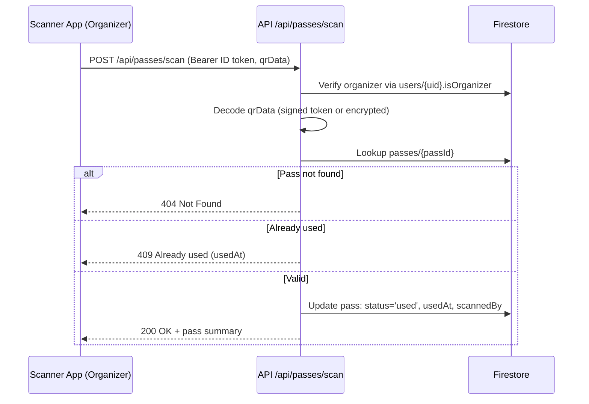

## System Architecture – CIT Takshashila 2026

This document describes the overall architecture of the TKwebsite production application, based strictly on the code in this repository.

- **Framework**: Next.js App Router (Next 16 style) deployed on Vercel
- **Frontend**: React (client components), Tailwind v4 + large custom CSS design system
- **Backend**: Next.js route handlers under `app/api/**` using Firebase Admin SDK
- **Data**: Firestore (client SDK + Admin SDK)
- **Payments**: Cashfree PG (JS SDK + server API)
- **Email**: Resend
- **Auth**: Firebase Authentication (Google sign-in)

---

### High-level System Diagram

Textual view of the main components and data flows:

- **Browser (User)**
  - Visits marketing and registration pages (`/`, `/events`, `/proshows`, `/sana-arena`, `/register/**`, `/payment/**`).
  - Authenticates with Firebase via Google.
  - Initiates payments via Cashfree JS SDK.
  - Views passes and QR codes; organizers scan passes.

- **Next.js App (Vercel)**
  - **App Router UI** (`app/**`)
    - Layout: `app/layout.tsx` wraps pages with:
      - `LenisProvider` (smooth scrolling context)
      - `ClientLayout` (global loading UX + referral capture)
      - `AuthProvider` (Firebase auth + profile)
      - `Navbar`
      - JSON-LD SEO scripts (organization + event)
    - Pages for:
      - Marketing / content (`/`, `/events`, `/events-rules`, `/proshows`, `/sana-arena`)
      - Registration and passes (`/login`, `/register/**`, `/register/my-pass`)
      - Payment callbacks (`/payment/callback`, `/payment/success`)
  - **API Routes** (`app/api/**`)
    - **Events**: `/api/events`, `/api/events/invalidate`
    - **Users**: `/api/users/profile`, `/api/users/passes`, `/api/users/referral-code`
    - **Payments**: `/api/payment/create-order`, `/api/payment/verify`, `/api/webhooks/cashfree`
    - **Passes & QR**: `/api/passes/types`, `/api/passes/qr`, `/api/passes/scan`, `/api/passes/scan-member`, `/api/passes/[passId]`
    - **Mock Summit**: `/api/mock-summit/countries`, `/api/mock-summit/assign-country`
    - **Admin tooling**: `/api/admin/reconcile-payments`, `/api/admin/fix-stuck-payment`
  - **Middleware** (`middleware.ts`)
    - Edge middleware that adds `X-Robots-Tag: noindex, nofollow` when the `Host` header matches `takshashila26.vercel.app`, preventing search indexing of the Vercel domain.

- **Firebase**
  - **Client SDK** (`src/lib/firebase/clientApp.ts`)
    - Initialized in the browser using `NEXT_PUBLIC_FIREBASE_*` env vars.
    - Provides `auth`, `db`, `storage` for client-side auth, profile fetch, and file uploads (ID cards).
  - **Admin SDK** (`src/lib/firebase/adminApp.ts`)
    - Initialized on the server using `FIREBASE_SERVICE_ACCOUNT_KEY` or `FIREBASE_ADMIN_CLIENT_EMAIL` + `FIREBASE_ADMIN_PRIVATE_KEY`.
    - Provides `getAdminAuth()` and `getAdminFirestore()` for secure ID token verification and Firestore access in API routes.

- **Firestore**
  - Collections defined by usage and `src/lib/db/firestoreTypes.ts`:
    - `events`, `appUsers`, `users`, `payments`, `passes`, `teams`, `mockSummitCountries`, `mockSummitAccessCodes`, `registrations`.
  - Security rules in `firestore.rules` enforce:
    - Per-user access to `appUsers` and `payments`.
    - Owner-or-organizer access to `passes` and `teams`.
    - Server-only writes to critical collections.

- **Cashfree PG**
  - **Client**: `src/features/payments/cashfreeClient.ts` loads `@cashfreepayments/cashfree-js` in the browser and opens modal checkout.
  - **Server**:
    - `POST /api/payment/create-order`: creates Cashfree order with correct amount and metadata.
    - `POST /api/payment/verify`: polls Cashfree REST API for order status.
    - `POST /api/webhooks/cashfree`: processes Cashfree webhook callbacks with HMAC verification.

- **Email (Resend)**
  - `src/features/email/emailService.ts` uses `RESEND_API_KEY` to send:
    - Welcome emails (on first profile creation).
    - Pass confirmation emails with attached PDF passes (from server).

---

### Core Data Flow Overview

#### Registration + Payment + Pass Issuance

```mermaid
sequenceDiagram
  participant U as User Browser
  participant N as Next.js App (UI)
  participant A as Next.js API Routes
  participant F as Firestore
  participant C as Cashfree PG
  participant E as Resend

  U->>N: Visit /login → sign in with Google
  N->>Firebase: Firebase JS SDK login
  Firebase-->>N: Firebase ID token + user
  N->>A: Create/update profile (POST /api/users/profile)
  A->>F: Write users/{uid}, appUsers/{uid}
  A-->>N: Profile saved

  U->>N: Visit /register/pass (select pass & events)
  N->>A: POST /api/payment/create-order (Bearer ID token)
  A->>F: Validate events via cached events & write payments/{orderId}[+teams/{teamId}]
  A->>C: Create Cashfree order
  C-->>A: order_id + payment_session_id
  A-->>N: orderId + sessionId
  N->>C: Open Cashfree JS SDK checkout
  C-->>U: Payment UI & redirect to return_url

  C->>A: Webhook (POST /api/webhooks/cashfree)
  A->>F: Mark payments status=success; create passes/{passId}
  A->>E: Send pass confirmation email (+ PDF)
  A-->>C: 200 OK

  U->>N: Land on /payment/callback?order_id=...
  N->>A: POST /api/payment/verify (orderId)
  A->>F: Lookup payments, ensure success, create pass if missing
  A->>E: (Optional) send email if pass was just created
  A-->>N: { success, passId, qrCode }
  N->>F: Fetch passes for /register/my-pass
  N-->>U: Display pass card, QR, lanyard, download PDF
```

#### QR Scan and Entry Flow



---

### Frontend vs Backend Responsibilities

- **Frontend (App Router + components)**
  - Renders all user-facing pages:
    - Marketing / content sections under `src/components/sections/home/**`.
    - Events listing and rules under `src/components/sections/events/**`.
    - Proshows and SANA arena under `src/components/sections/proshows/**` and `sana-arena` specific components.
    - Registration UI, pass selection modals, and forms under `src/components/sections/registration/**`.
    - My Pass display (card, QR image, 3D lanyard) plus client-side PDF generation helper.
  - Manages:
    - **Auth state** via `AuthContext` calling Firebase JS SDK.
    - **Loading UX** using `LoadingContext` and `LoadingScreen`.
    - **Smooth scrolling & scroll-based UI** via `LenisContext`, `useNavbarScroll`, and GSAP-based animations.
  - Delegates any trusted operations to backend APIs:
    - Payment creation, verification.
    - Pass fetching and QR regeneration.
    - Profile creation and server-side validation.

- **Backend (API routes)**
  - Owns all **trusted business logic**:
    - Authentication (ID token verification) and role enforcement (organizer checks).
    - Validation of pass types, event selections, phone numbers, and mock summit access codes.
    - Payment order creation with Cashfree and webhook/verify handling.
    - Server-side generation of QR codes and pass PDFs.
    - Admin reconciliation and “stuck payment” repair tooling.

- **Firestore & Security Rules**
  - Act as the **source of truth** for:
    - Events (`events` collection).
    - User profiles (`appUsers`, `users`).
    - Payments and passes (`payments`, `passes`).
    - Group teams and attendance (`teams`).
    - Mock summit allocations (`mockSummitCountries`, `mockSummitAccessCodes`).
  - `firestore.rules` tightly restricts what the client can read and forbids client-side writes to all critical collections.

---

### Serverless Architecture & Deployment Model

- **Deployment target**
  - The code and middleware behavior (checking `takshashila26.vercel.app` host) imply deployment on **Vercel**.
  - No `vercel.json` overrides; standard Vercel Next.js App Router deployment is assumed.

- **Runtime characteristics**
  - **App Router**:
    - Layout: `app/layout.tsx` is a server component defining metadata and wrapping children.
    - Most pages under `app/**` are client components (`'use client'`), as they rely heavily on animations, auth hooks, and browser APIs.
  - **Middleware**:
    - `middleware.ts` runs in the Edge Runtime for all non-static routes (except `_next/static`, `_next/image`, `favicon.ico`).
    - Concerned only with SEO robots tags, not auth.
  - **API Routes**:
    - Default Node/serverless runtime (no explicit `runtime` exports).
    - Each route is stateless; Firestore Admin and Cashfree clients are re-used across invocations where possible.
    - In-memory rate limiter (`src/lib/security/rateLimiter.ts`) is per-instance only.

- **Next.js configuration** (`next.config.ts`)
  - **React strict mode** disabled:
    - `reactStrictMode: false` with explicit comment that React 19 double-mounting breaks WebGL contexts (relevant for the 3D lanyard).
  - **Image optimization**:
    - Custom `images` config with AVIF/WebP formats, tuned device sizes, and `minimumCacheTTL` of 30 days.
  - **Headers**:
    - Global `Cross-Origin-Opener-Policy: same-origin-allow-popups` for all paths.
  - **Performance**:
    - `compress: true` and `poweredByHeader: false`.
    - Production webpack optimization with `splitChunks.maxSize = 200_000` bytes for better caching behavior.

---

### External Integrations

#### Firebase

- **Client** (`src/lib/firebase/clientApp.ts`)
  - Reads env:
    - `NEXT_PUBLIC_FIREBASE_API_KEY`
    - `NEXT_PUBLIC_FIREBASE_AUTH_DOMAIN`
    - `NEXT_PUBLIC_FIREBASE_PROJECT_ID`
    - `NEXT_PUBLIC_FIREBASE_STORAGE_BUCKET`
    - `NEXT_PUBLIC_FIREBASE_MESSAGING_SENDER_ID`
    - `NEXT_PUBLIC_FIREBASE_APP_ID`
  - Provides:
    - `auth` for Google sign-in and ID token issuance.
    - `db` for client-side reads of `appUsers` and `users`.
    - `storage` for ID card uploads.

- **Admin** (`src/lib/firebase/adminApp.ts`)
  - Configured from:
    - `FIREBASE_SERVICE_ACCOUNT_KEY` **or**
    - `FIREBASE_ADMIN_CLIENT_EMAIL` + `FIREBASE_ADMIN_PRIVATE_KEY` (+ `NEXT_PUBLIC_FIREBASE_PROJECT_ID`).
  - Exported helpers used in API routes:
    - `getAdminAuth()` – verifies ID tokens (organizer checks rely on this).
    - `getAdminFirestore()` – performs all server-side Firestore operations.

#### Cashfree

- **Client-side** (`src/features/payments/cashfreeClient.ts`)
  - Uses `@cashfreepayments/cashfree-js`.
  - `NEXT_PUBLIC_CASHFREE_ENV` controls environment (`sandbox` vs `production`).
  - `openCashfreeCheckout(paymentSessionId, orderId?)` opens modal checkout and returns a normalized result.

- **Server-side**
  - `CASHFREE_BASE` URL in multiple routes determined by `NEXT_PUBLIC_CASHFREE_ENV`.
  - `CASHFREE_APP_ID` / `NEXT_PUBLIC_CASHFREE_APP_ID` + `CASHFREE_SECRET_KEY` used for REST API authentication.
  - Endpoints:
    - `POST /api/payment/create-order` – `POST {order_amount, customer_details, order_meta}` to `/orders`.
    - `POST /api/payment/verify` – `GET /orders/{orderId}` for status polling.
    - `POST /api/webhooks/cashfree` – validates HMAC signatures from webhook callbacks.

#### Resend (Email)

- `src/features/email/emailService.ts`:
  - Creates a `Resend` client using `RESEND_API_KEY`.
  - Defines:
    - `emailTemplates.welcome(name)` for onboarding.
    - `emailTemplates.passConfirmation({...})` for pass confirmations.
  - `sendEmail` is used by:
    - `/api/users/profile` on first-time profile creation.
    - Payment completion flows (`webhooks/cashfree`, `payment/verify`, `admin/fix-stuck-payment`) to send pass confirmations with PDF attachments.

---

### Summary

The TKwebsite system is a Next.js App Router application deployed on Vercel that uses:

- Firebase Authentication for identity and ID tokens.
- Firestore as the primary data store with strict client-side rules and server-only writes for sensitive collections.
- Cashfree for payment processing, using both webhooks and explicit verification, with pass creation guarded by Firestore transactions.
- A QR-based pass system with HMAC-signed and AES-encrypted payloads, scanned through organizer-only APIs.
- Resend for transactional emails, including PDF pass attachments generated server-side.

All critical business logic—including payments, pass issuance, QR verification, and organizer privileges—is enforced on the server using Firebase Admin and Firestore, with the frontend focused on a rich, animated user experience.

