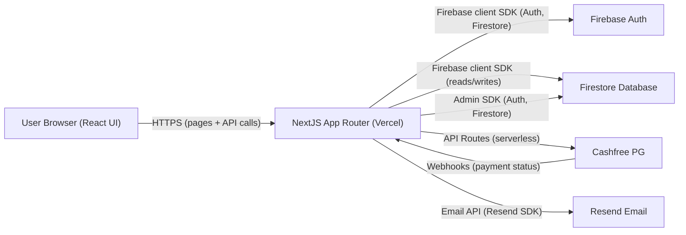

## 1. Executive Summary

**System name:** CIT Takshashila 2026 Registration & Pass Management Platform  
**Platform type:** Full-stack web application (event registration, payments, QR-based access control)

This system powers Chennai Institute of Technology’s flagship techno‑cultural fest, **Takshashila 2026**. It enables students and attendees to:

- Discover events and proshows
- Register and purchase different pass types
- Pay securely through **Cashfree**
- Receive email confirmations and PDF/QR passes
- Enter events and proshows via **QR code scanning** at the gate

Organizers and volunteers use the same platform to:

- Verify passes at entry using signed QR codes
- Manage **group events** and team attendance
- Inspect and recover “stuck” payments

The application is built with **Next.js 16 (App Router)**, **React 19**, **Firebase (Auth + Firestore)**, **Cashfree Payments**, and **Resend** for transactional email, and is deployed on **Vercel**.

---

## 2. System Overview

### 2.1 Platform Type & Use Cases

- **Category:** Event registration & ticketing system
- **Primary use cases:**
  - Public marketing site for the fest (home, events, proshows, SaNa concert)
  - User registration, profile capture, and pass purchase
  - Online payments and receipt of digital passes
  - Venue access control using QR codes
  - Group registrations for team‑based events

### 2.2 High-Level Feature Overview

- **Marketing & information**
  - Landing page with hero, about, showcase and sponsors
  - Events listing with technical / non‑technical filters
  - Proshows and **SaNa Arena** concert pages
  - Events rules and guidelines

- **User account & profile**
  - Google sign‑in via Firebase Authentication
  - Firestore‑backed user profile: name, college, phone

- **Passes & payments**
  - Four pass types with fixed pricing (`day_pass`, `group_events`, `proshow`, `sana_concert`)
  - Secure payment via Cashfree, using popup/modal checkout
  - Robust verification: Cashfree webhook + client‑side verify call
  - Automatic pass creation with signed QR payloads
  - Email confirmation with embedded QR and (optionally) PDF pass

- **Access control & team management**
  - Organizer‑only QR scanning API
  - Pass usage tracking (used / unused, scannedBy, usedAt)
  - Group team documents with per‑member attendance
  - Separate APIs for scanning a **pass** vs scanning **team members**

- **Operations & admin**
  - Admin API for recovering “stuck” payments (when webhook or verify flow fails)
  - Scripts for inspecting, debugging and seeding Firestore data
  - Extensive Firestore rules to enforce per‑user and organizer permissions

### 2.3 Tech Stack Summary

| Layer         | Technology                                                                 |
|--------------|-----------------------------------------------------------------------------|
| Framework    | Next.js 16 (App Router)                                                     |
| UI           | React 19, Tailwind CSS 4, custom CSS, Framer Motion, GSAP, Lenis           |
| Language     | TypeScript 5                                                                |
| Backend      | Next.js API Routes (serverless on Vercel)                                  |
| Database     | Firebase Firestore                                                          |
| Auth         | Firebase Authentication (Google sign‑in)                                    |
| Email        | Resend                                                                      |
| Payments     | Cashfree Payment Gateway (sandbox & production modes)                       |
| QR & PDFs    | `qrcode`, `html2canvas`, `jspdf`, `canvas`                                  |
| Hosting      | Vercel (web app + API routes)                                              |
| Tooling      | ESLint, TypeScript, Tailwind/PostCSS, Turbopack (dev), Webpack (prod)      |

### 2.4 Environment Types

The system is designed around two primary environments:

- **Development**
  - Local Next.js dev server (`npm run dev`)
  - Firebase project (usually a dev/sandbox instance)
  - Cashfree **sandbox** environment (`NEXT_PUBLIC_CASHFREE_ENV=sandbox`)
  - Resend test sender (`onboarding@resend.dev`)

- **Production**
  - Deployed on **Vercel** from the `main` branch
  - Firebase project with production data
  - Cashfree **production** environment (`NEXT_PUBLIC_CASHFREE_ENV=production`)
  - Resend production sender (custom verified domain, recommended)

(A separate staging environment can be introduced by creating another Vercel project and Firebase project with the same configuration pattern.)

---

## 3. High-Level Architecture

### 3.1 Architectural Pattern

- **Client‑server web app** built on **Next.js App Router**
- **Serverless backend**: each API route in `app/api/**` runs as its own function on Vercel
- **Backend‑for‑Frontend (BFF)**: API routes encapsulate Firebase Admin, Cashfree, and Resend interactions specifically for this frontend
- **Event‑driven flows**:
  - Cashfree webhooks drive payment state transitions and pass creation
  - QR scan events drive pass state changes and attendance updates

### 3.2 High-Level Component Diagram

### 3.3 Client–Server Interaction

- **Page rendering**
  - Marketing and content pages are rendered by Next.js and hydrated on the client.
  - Heavier sections (e.g. some hero/3D areas) are dynamically imported to keep the initial bundle small.

- **Authenticated interactions**
  - The browser uses the Firebase client SDK to sign in with Google.
  - The resulting **ID token** is included as a `Bearer` token in `Authorization` headers for protected API routes.
  - Server‑side routes use Firebase **Admin SDK** to verify the token and authorize the user.

- **Data access**
  - Client components read and write some data directly via the Firebase client SDK (e.g. profile reads, some pass reads).
  - Sensitive writes (payments, pass creation, attendance scans) go through **API routes** which use the **Admin SDK** and enforce domain‑specific logic.

### 3.4 API Communication Flow (Payments & Passes)

At a high level:

1. User selects a pass and submits the registration form.
2. Frontend calls `POST /api/payment/create-order` with:
   - Firebase ID token (Authorization header)
   - Pass type, amount, and customer details (and optional team data)
3. Backend:
   - Verifies the ID token
   - Validates pricing and input
   - Creates a **pending payment** record in `payments` collection
   - Optionally creates/updates a `teams` document (group events)
   - Calls Cashfree API to create an order and returns `orderId` + `paymentSessionId`
4. Frontend opens the Cashfree checkout modal using the session ID.
5. After payment:
   - Cashfree triggers a **webhook** to `/api/webhooks/cashfree`
   - The frontend also calls `/api/payment/verify` with the `orderId`
6. Backend verifies the order status with Cashfree; on success:
   - Updates `payments` document to `status='success'`
   - Creates a `passes` document with a signed QR payload and optional team snapshot
   - Sends a **Resend email** with confirmation and (optionally) PDF
7. User is redirected to a success page and can see the pass under `/register/my-pass`.

Detailed request/response contracts are documented in `docs/BACKEND_API_REFERENCE.md` and `docs/PAYMENT_WORKFLOW.md`.

### 3.5 Authentication & Authorization Flow (Overview)

- **Sign‑in:**
  - Initiated from the frontend using Firebase client SDK and Google provider.
  - Auth state is exposed through `AuthContext` (`user`, `userData`, `loading`, `signIn`, `signOut`).
  - On first login, a Firestore `users/{uid}` document is created or updated with profile data.

- **Protected routes:**
  - Frontend redirects unauthenticated users away from protected pages (e.g. register, my‑pass).
  - Protected API routes:
    - Extract `Authorization: Bearer <idToken>` header
    - Verify token via Firebase Admin (`verifyIdToken`)
    - Perform ownership checks (e.g. `payment.userId === uid`, `pass.userId === uid`)
    - Enforce role checks (organizer vs normal user) based on `users/{uid}.isOrganizer`.

- **Data access rules:**
  - Firestore security rules restrict direct access:
    - Users can read/write their own `users/{uid}` document (cannot set `isOrganizer`).
    - Users can only read their own `payments` and `passes` documents.
    - Organizers can read and update passes/teams for scanning/attendance.

Full details are in `docs/AUTHENTICATION_AUTHORIZATION.md`.

### 3.6 Error Handling Strategy (Overview)

- **Client‑side**
  - Loading and error states in registration and payment flows.
  - User‑facing alerts for major issues (e.g. sign‑in failures, network problems).

- **Server‑side**
  - Consistent `try/catch` blocks in API routes.
  - Structured JSON error responses with meaningful HTTP status codes:
    - `400` – validation errors / bad input
    - `401` – unauthenticated
    - `403` – forbidden (role or ownership mismatch)
    - `404` – not found (payment, pass, team)
    - `409` – conflict (pass already used, member already checked in)
    - `429` – rate‑limited
    - `500` – unexpected server error
  - Logging of full error objects to Vercel logs for debugging.

Detailed per‑endpoint behavior is captured in `docs/BACKEND_API_REFERENCE.md` and `docs/MAINTENANCE_OPERATIONS.md`.

---

## 4. Document Map

This overview file is the entry point for the full documentation set:

- **Architecture & layout**
  - `docs/PROJECT-LAYOUT-AND-ARCHITECTURE.md`
  - `docs/FRONTEND_ARCHITECTURE.md`
  - `docs/BACKEND_API_REFERENCE.md`
  - `docs/DATABASE_SCHEMA.md`
- **Security & workflows**
  - `docs/AUTHENTICATION_AUTHORIZATION.md`
  - `docs/PAYMENT_WORKFLOW.md`
  - `docs/PASS_QR_SYSTEM.md`
- **Platform & operations**
  - `docs/DEPLOYMENT_HOSTING.md`
  - `docs/MAINTENANCE_OPERATIONS.md`
  - `docs/SCALABILITY_PERFORMANCE.md`
  - `docs/DEVELOPER_GUIDE.md`
  - `docs/EMAIL_SYSTEM.md`
- **Reference**
  - `docs/DESIGN-LANGUAGE.md`
  - `docs/GLOSSARY.md`
  - `docs/FAQ.md`
  - `docs/CHANGELOG.md`

